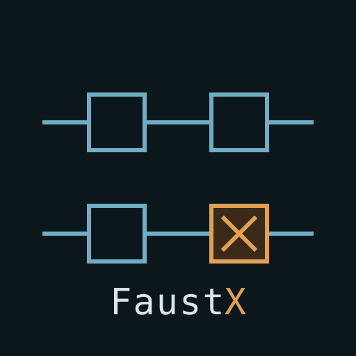

# FaustScript — live coding on top of Faust

**[roomi-fields.github.io/faustscript](https://roomi-fields.github.io/faustscript/)** — the five Faust
signs, and what happens to each one.

**FaustScript is a language for patching while the sound is playing.** It adds to
[Faust](https://faust.grame.fr) the two things live performance needs and Faust
does not have: **naming one instance**, and **acting on that instance while it
runs**.

It computes nothing. A FaustScript program is **translated into Faust**, and Faust
compiles it — with the functions its libraries declare, untouched.

```faustscript
let saw1 os.sawtooth(freq=110)
let lpf1 fi.lowpass(fc=800)

saw1 : lpf1 : process
```

becomes

```faust
import("stdfaust.lib");
saw1 = vgroup("saw1", os.sawtooth(hslider("freq[unit:Hz][scale:log]", 110, 0.08, 220, 0.001)));
lpf1 = vgroup("lpf1", fi.lowpass(4, hslider("fc[unit:Hz][scale:log]", 800, 2, 8000, 0.001)));
process = saw1 : lpf1;
```

The filter order stays a constant, `fc` becomes a slider with its real bounds
and a logarithmic scale, and the instance name becomes the control path
`/lpf1/fc`. All of that comes from the catalogue; you wrote `fc=800`.

---

## Why a new language at all

In Faust, **a name is a macro**: it is replaced by its body during evaluation,
so writing `lpf` twice builds two filters. Measured with faustwasm 0.19.0
(Faust 2.90.0): one use of `fi.lowpass(3, 800)` produces a circuit with **15
memory fields**, two uses produce **22**: each use carries its own 7 fields of
filter state, the 8 others are constants set once from the sample rate and
shared.

Separate state is therefore free — but **no Faust expression can point at an
instance that already exists**. Naming duplicates; there is no address. That is
what stops you from writing, an hour into a set, *"that filter, the one that is
currently ringing — open it up."*

FaustScript gives that address, and nothing else.

---

## The principle

**Decorate Faust's own signs; do not invent new ones.** The `:` stays the
connection, and what surrounds it qualifies it.

| written | what it does | |
|---|---|---|
| `A : B` | connect | Faust |
| `let lpf1 fi.lowpass` | place **one** instance | FaustScript |
| `let lpfs:8 fi.lowpass` | place eight | FaustScript |
| `lpf1 fi.lowpass(fc=400)` | replace its body, memory kept | FaustScript |
| `!let lpf1` | give the name back | FaustScript |
| `saw1 :8 lpf1` | connect as eight instances | FaustScript |
| `saw1 !: lpf1` | cut the wire | FaustScript |
| `dly1 ~ fb1` · `dly1 !~ fb1` | close · open a feedback loop | Faust · FaustScript |
| `_ lpf1` · `!_ lpf1` | bypass · un-bypass | FaustScript |
| `! lpf1` | remove it and its wires | FaustScript |
| `lpf1.fc = 400` | set one control | FaustScript |
| `lpf1(fc=400, q=2)` | set several at once | FaustScript |
| `lfo1 : lpf1.fc` | drive a control with a signal | FaustScript |
| `saw1.3` | one channel of an instance | FaustScript |

**Three rules, and nothing else to remember:** a `!` in front cancels what
follows it, a digit after says how many, and the dot reaches into an instance.

**`=` gives a value, `:` connects:** `fc=800` gives a parameter its value,
`lpf1.fc = 400` sets a port, `a : b` connects, and on a wiring line `:8` or `: 8`
connects as eight copies. A Faust definition runs up to its `;`, as in Faust;
any other line is one gesture.

The gain is measurable. `par(i,8,saw) : par(i,8,lpf)` is 28 characters;
`saw1 :8 lpf1` is 12. **Live, that is the difference between typing while it
plays and not managing at all.**

---

## What FaustScript does not do

**It computes nothing.** Every sample is Faust's work.

**It knows nothing about musical time.** When a gesture happens is decided by
whatever invokes it.

**It knows nothing about your stage.** Its sink is `process`, Faust's own, so a
program runs standalone; wiring inputs and outputs to devices or to an actor's
channels belongs to the host.

**It never modifies the Faust compiler.** Nothing here is a fork.

---

## Behaviour worth knowing about

These follow from Faust's own routing, and they match VCV Rack:

**Cutting a wire feeds silence, it does not remove the input.** Cut the bass
feeding an amplifier and the branch goes quiet — rather than the envelope being
multiplied by itself and carrying on.

**Several wires into one input sum.** Three oscillators into one filter mix,
like three players around one microphone.

**One wire into several inputs is copied.** One LFO drives two filters exactly
in phase — one LFO, not two.

**Nothing is cut off abruptly.** A bypassed or removed instance keeps running on
silence, so what was ringing inside finishes ringing. Faust's own `ba.bypass1`
does the opposite — measured, a reverb's 97 memory fields drop to 0, the instance
is erased; ours keeps 81.

**A wrong line raises an error and the sound does not stop.** The graph is never
touched until the program compiles.

---

## Status

**The language is settled.** All eight elements of Faust have been reviewed —
definition, the five composition operators, routing primitives, substitution,
iterators, interface parameters, entry point, imports — and every claim in the
specification was checked by compiling.

**The transpiler works.** The three pieces in `examples/` translate without a
single rejected gesture, and the Faust they produce compiles. 34 tests, a dozen
of which invoke the real compiler.

**The catalogue declares the modules Faust's libraries declare** — parameters,
starting values, bounds, measured input and output counts, and measured output
ranges. It is generated from the documentation of the libraries that the pinned
`@grame/faustwasm` carries, by `tools/generate-declarations.py`
(`npm run catalogue`); its header records the versions and the count.

**What is not true yet:** *every Faust program is a FaustScript program* is the
stated goal, not the current state. The grammar reads FaustScript, plus Faust's
definitions, imports, operators, iterators and feedback — but not yet `with{}`,
`letrec`, pattern matching or explicit substitution. Real `.dsp` files do not
parse whole.

**There is no sound here.** FaustScript emits Faust source. Compiling it while the
audio runs, and swapping an instance without dropping a sample, belongs to the
host — that is where the measured **~32 ms** per instance recompilation matters,
against ~620 ms for a fifty-instance program. Both are taken through libfaust
compiled to WebAssembly, which is what a browser host runs; rerun them with
`node tools/measure-compilation.mjs`.

---

## Try it

```bash
npm install
npx faustscript examples/1-drone-that-plays-alone.fsc
```

It prints the Faust. `-o file.dsp` writes it instead. Gestures it refuses go to
standard error, with their reason and the line — the rest of the file is still
translated, which is the rule.

As a library:

```js
import { createTranspiler } from 'faustscript'

const faustscript = createTranspiler(catalogue, templates)
faustscript.apply('let lpf1 fi.lowpass(fc=800)\n_ : lpf1 : process\n')
faustscript.write()          // the Faust
```

Requires Node 22+. The tests compile with `@grame/faustwasm` 0.19.0, which
carries Faust 2.90.0.

---

## How it is built

The rule the whole implementation obeys: **no sign of the language is written
anywhere in the code.** The grammar generates the parser, the catalogue declares
the modules, the templates say what each form becomes in Faust — and a test
fails if any of it leaks into the engine.

| | |
|---|---|
| `src/faustscript.grammar` | the grammar; it **generates** `src/parser.js` (Lezer) |
| `lib/faust.fsc` | the catalogue — the modules Faust's libraries declare, itself written in FaustScript |
| `lib/translation.fsc` | templates, reserved words, decision rules |
| `src/` | graph, reading, staging, emission — none of it knows the language |

---

## Documentation

`docs/LANGUAGE.md` — the reference: how to write FaustScript.
`docs/ARCHITECTURE.md` — how the transpiler is built.
`docs/PRINCIPES.md` — the principles: why each sign is the one it is.

---

## Licence and upstream

**FaustScript is MIT licensed** — see `LICENSE`. Nothing is imposed on anyone using
it.

The Faust compiler is LGPL 2.1, and **the code it generates is not covered by
it** — GRAME's FAQ states so explicitly. FaustScript requires **no change to the
compiler** and touches none of its 304 architecture files, whose licence
exception holds precisely on the condition that they are not modified.

FaustScript is an independent project. It is not affiliated with GRAME-CNCM, who
develop Faust.
