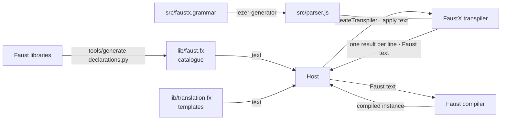
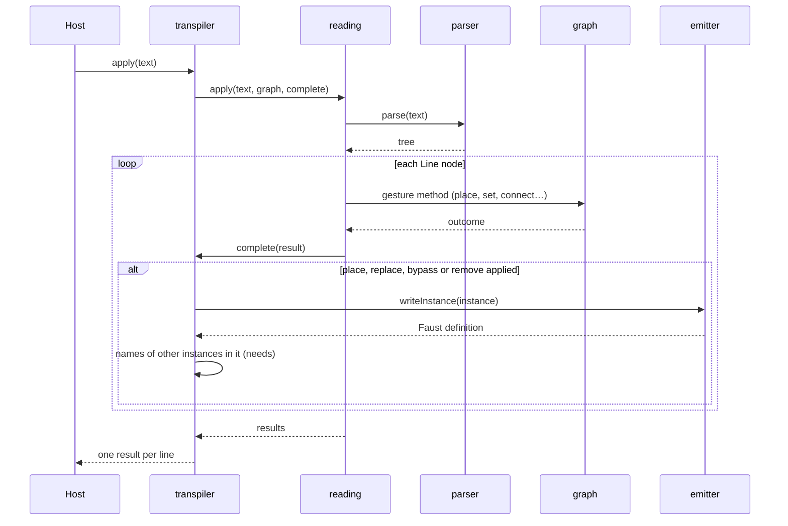
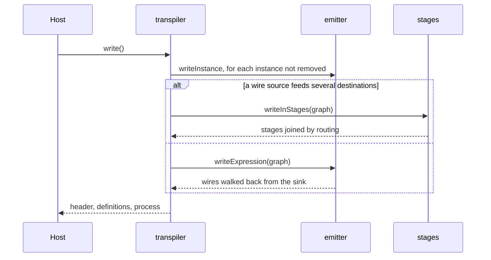

# FaustX — architecture

The FaustX transpiler is a JavaScript library that holds the graph of a piece and writes Faust from it. It parses FaustX text with a parser generated from the grammar, applies each line as a gesture on the graph, and fills the templates of `lib/translation.fx` to write the Faust of one instance or of the whole program. Its role and its boundary are in `CADRE.md`; the forms that cross that boundary are in `INTERFACE.md`.

## 1. Context

The host creates a transpiler with the texts of the two files under `lib/`, sends it FaustX text, and gives the Faust it returns to a Faust compiler. Two tools prepare the transpiler's inputs before any run: `tools/` generates the catalogue from Faust's libraries, and `lezer-generator` (`npm run grammaire`) generates the parser from the grammar.



The command `faustx` (`bin/faustx.js`) is a host of its own: it reads the two files under `lib/` and a `.fx` file, applies the file to an empty graph, and writes the whole program.

## 2. Strategy

1. **The grammar generates the parser, and the signs of the language live in the files under `lib/`.** The code reads the names of the tree's nodes, the catalogue and the templates; the text of a sign appears only in `src/faustx.grammar` and `lib/translation.fx`. Reason: renaming a sign or changing what a form becomes in Faust changes a file the code reads, and the published grammar is the parser that runs.
2. **A living graph is the state, and each line is a gesture on it.** The transpiler keeps the instances and the wires between calls; a line changes the graph and returns what it changed. Reason: a line typed while the sound plays describes a change, not a program, and only the graph knows what a name designates (`lpf1(fc:400)` is a call or a setting depending on what is placed).
3. **Each instance is written alone, as one Faust definition.** A gesture that changes an instance's circuit returns that definition and the instances it cites. Reason: the host compiles one instance instead of the program, which costs about nineteen times less for fifty instances (§8).
4. **The program is written in stages as soon as a signal is shared.** When one instance feeds more than one destination, the program places the instances in stages and routes the channels between them, so each instance is written once. Reason: Faust builds one circuit for each occurrence of a name, so a name written twice would make two circuits with two memories.

## 3. Components

```mermaid
flowchart TD
  transpiler[transpiler.js] --> catalogue[catalogue.js]
  transpiler --> templates[templates.js]
  transpiler --> graph[graph.js]
  transpiler --> reading[reading.js]
  transpiler --> emitter[emitter.js]
  transpiler --> stages[stages.js]
  reading --> parser[parser.js<br>generated]
  reading --> graph
  catalogue --> parser
  emitter --> parser
  bin[bin/faustx.js] --> transpiler
```

- **parser** (`src/parser.js`, generated from `src/faustx.grammar` by Lezer) turns a text into a tree whose node names are the grammar's rule names. It owns no state. Lezer is CodeMirror's parser, so an editor built on CodeMirror highlights FaustX with the same grammar.
- **catalogue** (`src/catalogue.js`) reads the text of `lib/faust.fx` with the parser and returns a table from module name to module. It owns the module records; it calls the parser.
- **templates** (`src/templates.js`) reads the text of `lib/translation.fx` into a table from key to value and fills a value's places between braces. It owns that table; it calls nothing.
- **graph** (`src/graph.js`) holds the instances and the wires and carries one method per gesture (`place`, `replace`, `release`, `remove`, `bypass`, `set`, `connect`, `cut`), each returning an outcome. It owns the state of the piece; it calls nothing, and carries the catalogue that reading and the emitter read through it.
- **reading** (`src/reading.js`) applies a parsed text to the graph: for each line, it maps the form's node name to a gesture, reads the names, bodies and settings out of the tree, and calls the graph's method. It owns no state beyond the counter that names computed signals; it calls the parser and the graph.
- **emitter** (`src/emitter.js`) writes the Faust definition of one instance and, by walking the wires back from the sink, the expression of a program where no signal is shared. It owns no state; it reads the catalogue, the templates and the graph, and parses the body of an instance written as a Faust expression to translate the modules it calls.
- **stages** (`src/stages.js`) writes the expression of a program where a signal is shared: it places the instances in stages, counts each instance's inputs and outputs, and writes the routing between two stages. It owns no state; it reads the catalogue, the templates and the graph.
- **transpiler** (`src/transpiler.js`) creates the other components and exposes `createTranspiler`, `apply` and `write`. It owns one catalogue, one templates table and one graph; it calls reading, emitter and stages.
- **command line** (`bin/faustx.js`) reads the files, calls the transpiler, and writes the program and the refused lines.

## 4. Data

| structure | form | created by | read by | lifetime |
| --- | --- | --- | --- | --- |
| tree | Lezer tree of the text passed to `apply`, or of the catalogue, or of one body | parser | reading, catalogue, emitter | one call |
| module | name; parameters (name, starting value); body as written; attributes keyed `parameter.attribute`; number of inputs and outputs | catalogue | graph, emitter, stages | the transpiler |
| templates table | key → value, as written in `lib/translation.fx` | templates | emitter, stages, transpiler | the transpiler |
| instance | name; body (a module name, or a Faust expression as written); number of copies; settings (port → value as written); `bypassed`; `removed` | graph, on `place` | reading, emitter, stages | until `release` |
| wire | from and to (each a name and an optional port or channel); width; `loop` | graph, on `connect` | emitter, stages | until `cut`, or until an end is released or removed |
| outcome | `done`, and the sentence of a refusal | graph, reading | transpiler, host | one line result |
| stages | the instance names stage by stage, and each loop's return and source | stages | stages | one `write` |

The graph keeps instances in a `Map` in the order they were placed and wires in an array in the order they were laid; the emitter and the stages iterate in that order. The number of a module's inputs and outputs comes from a comment line that the generator writes under each module, and, when that line is missing, from the module's measured output range.

## 5. Flow

`apply` parses the whole text once, then handles its lines in order. Each line is applied to the graph, and its result is completed right after it, so that it describes the line at the moment it was applied.



`write` writes the header, one definition per instance in the flow, then `process`. Its expression comes from the emitter when every instance is the source of at most one wire, and from the stages otherwise; an empty graph gives the silence template.



## 6. Run time

The transpiler is an ES module for Node 22 or later, and runs in the host's process and thread. Every call is synchronous and performs no input or output; the command line alone reads and writes files. Each transpiler parses its own copy of the catalogue at creation and keeps it with its graph for its whole life. The parser imports `@lezer/lr` at run time. The Faust compiler runs in the host; the tests call it through `@grame/faustwasm` to check that the Faust written compiles.

## 7. Cross-cutting concepts

- **Identity.** An instance is identified by the name the author wrote; a computed signal by a name reading gives it, `computation` followed by a counter. In the Faust written, an instance whose body carries a control is wrapped in a group named after it, so its control path starts with the instance's name.
- **Errors.** A gesture the graph cannot apply returns an outcome that carries a sentence naming the cause; the line's result carries that outcome. A key missing from the templates throws `template missing: <key>`.
- **Determinism.** The graph, the catalogue and the templates iterate in insertion order, and nothing reads the clock or a random source, so the same text in the same order of gestures writes the same Faust.
- **Signs out of the code.** Reading recognises a form by its node name, and the emitter and the stages take the text of each Faust form from a template key. A test reads the string literals of every hand-written file under `src/` and fails on the declaration word, the sink's name, a cut, a width written in place, or the input sign.

## 8. Quality

The cost that counts is the compilation the host performs after a gesture; the transpiler's own work per line is small beside it, and not measured. `tools/measure-compilation.mjs` measures what a gesture saves by recompiling one instance: the median of twelve compilations after three warm-up rounds, with the compiler's cache defeated at each round. The figures move by about a tenth from one run to the next.

| what is recompiled | browser (libfaust-wasm 0.16.6, Faust 2.86.2) | native (Faust 2.70.3, same WebAssembly backend, 34 ms start-up removed) |
| --- | --- | --- |
| one instance | ~32 ms | ~30 ms |
| 5 instances | ~64 ms | ~60 ms |
| 20 instances | ~200 ms | ~185 ms |
| 50 instances | ~620 ms | ~520 ms |

A fifty-instance program costs about 19 times one instance (17 to 21 depending on the run): this ratio is why an instance is the unit of compilation (`CADRE.md` R16).

The separation costs computation in the compiled program, measured with Faust 2.70.3:

- compiling per instance instead of as one block: +12.9 % operations, since Faust no longer optimises across instances;
- a controlled port instead of a constant: +17 % operations on a third-order filter;
- the instance's name: no operation, since a Faust group is a label.

Together, a program written by FaustX computes about 30 % more than the same Faust written as one block with every value constant. A width is fixed at compilation: changing it while the sound plays recompiles the instance, about 32 ms. An external measurement of on-the-fly recompilation finds 6 to 52 ms depending on the module (arXiv:2606.13193v1).

## 9. Risks

- **Atomicity and shared state** (faustx-zj5.12): a refused line can leave part of its wires or a computed signal in the graph, the counter of computed signals is shared by every transpiler of the process, and a line the grammar does not read can be applied as a wire.
- **Refusal codes and the result of a setting** (faustx-zj5.9): an outcome carries a sentence and no code, and a `set` result carries neither the port, the value nor the path.
- **The surface** (faustx-zj5.10): the package exports the graph and the catalogue modules, and the transpiler exposes its internal graph and catalogue as fields; the target is the one function and the frozen views of `INTERFACE.md`, in TypeScript.
- **Gaps with the language reference** (faustx-zj5.13 to faustx-zj5.22): the number after a connection sign, channels, silence on a cut wire, width adaptation, chain terms that are not instances, settings on an instance, calls outside the catalogue, Faust's own forms, declarations and imports in a text, resizing a bank. Each ticket names the rule of `LANGUAGE.md` and the line that shows the gap.
- **Counts inferred by the code.** The number of inputs of a body written as a Faust expression is read from the shape of its text, and a module's numbers of inputs and outputs travel in a comment of the catalogue; the Faust compiler is the source that gives them exactly.
- **What the guard sees** (faustx-zj5.11, its bite proof): it looks for five forms in string literals; the Faust forms that the stages and the emitter write directly (`route`, `si.bus`, the parentheses of a call) and the names of the catalogue's modules are outside its patterns.
- **The run-time dependency** (faustx-zj5.26): `package.json` declares `@lezer/lr`, which the parser imports, among the development dependencies only.
- **An instance cited by a body** (faustx-zj5.24): the program is written in stages only when an instance is the source of several wires, so an instance in the flow that a computed signal also cites (`lpf1 * 3 : process`) is written twice and becomes two circuits.
- **The cost of a line** (faustx-zj5.25): no instrument measures what one applied line costs, nor what creating a transpiler costs, so `CADRE.md` R16 has no ceiling yet.
