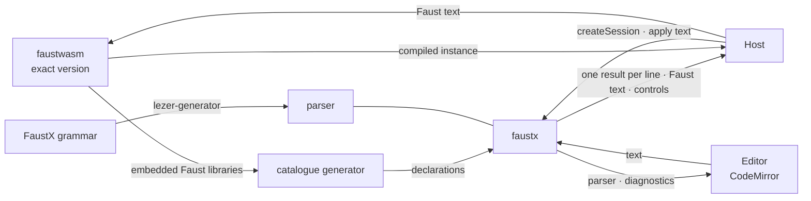
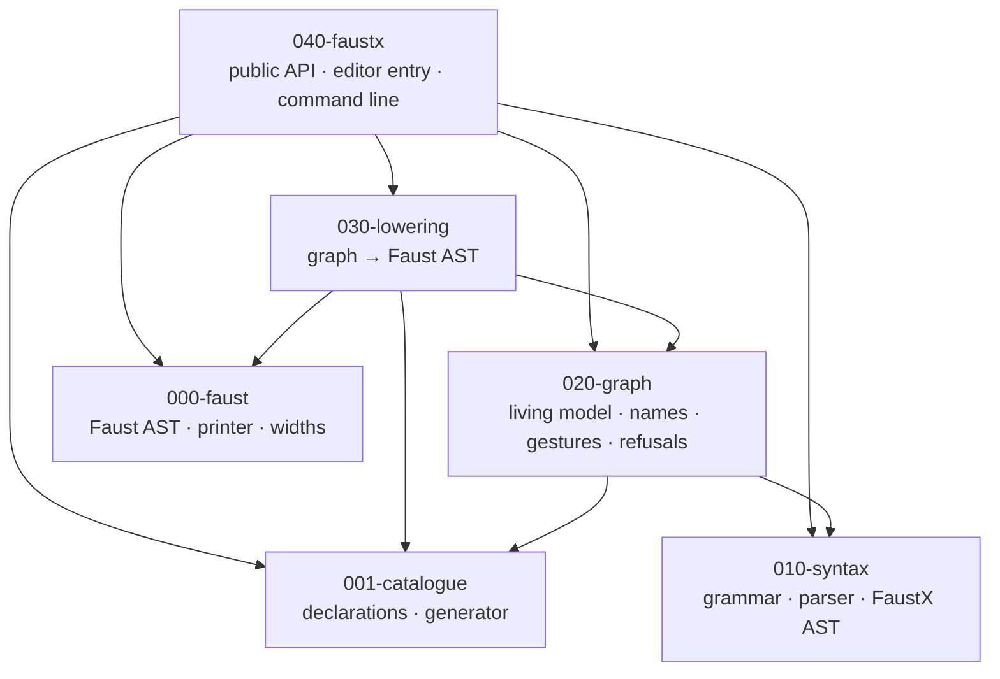
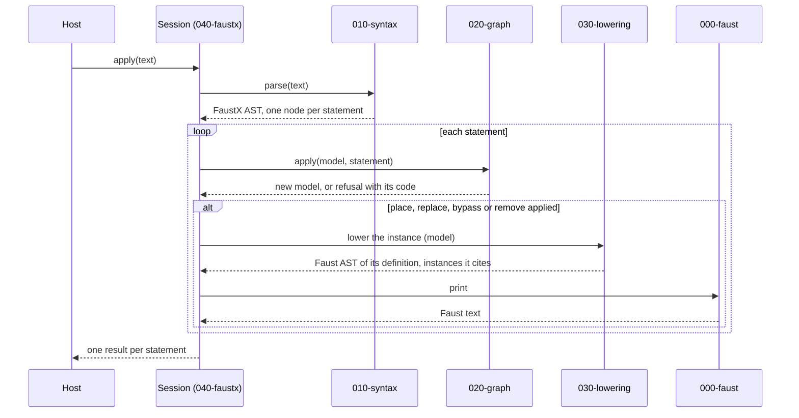

# FaustX — architecture

FaustX is a TypeScript library, with its command line, that holds the graph of a piece being played and writes Faust from it. It reads FaustX text into a typed tree with a parser generated from the grammar, applies each line as a gesture on a living graph whose names are resolved on that tree, lowers the graph into a tree of Faust, and prints that tree as the Faust text the host compiles. Six packages carry these steps; one of them, `faustx`, is published. This document describes the target construction: the code reaches it package by package (faustx-zj5.30 to faustx-zj5.36). The public package's role and boundary are in `packages/040-faustx/docs/CADRE.md`, the forms that cross it in `packages/040-faustx/docs/INTERFACE.md`.

## 1. Context

The host creates a session for each piece, sends it FaustX text, and compiles the Faust it returns with faustwasm, at the exact version the package declares as a peer dependency. An editor reads the grammar's parser and the diagnostics of a text from a second entry of the same package. Two tools prepare inputs before any run: the generator builds the catalogue from the Faust libraries that faustwasm version embeds, and `lezer-generator` builds the parser from the grammar.

The command `faustx` is a host of its own: it applies a `.fx` file to a new session and writes the whole program.

## 2. Strategy

1. **The grammar carries FaustX's signs.** The parser is generated from the grammar, and the code reads node names, never the text of a sign. Reason: renaming a sign changes the grammar only, and the parser that runs is the published grammar, the one an editor highlights with.
2. **Each language has one tree, read once.** A FaustX text becomes a FaustX AST that keeps every position; a body becomes a typed node, a catalogue call with its ordered arguments or a Faust expression as a tree. The Faust output is a Faust AST. Each step reads the tree the step before it built. Reason: a tree carries what a writing means, where a step that slices or re-parses text has to guess it (Babel keeps parsing, trees and printing apart for the same reason).
3. **The graph resolves names on the tree.** A line is a gesture on a living graph that keeps instances and wires between calls; what a name designates (`lpf1(fc:400)` is a call or a setting depending on what is placed) and what a body cites are resolved on the FaustX AST, against the graph and the catalogue. Reason: a line typed while the sound plays describes a change, not a program; only the graph knows what is placed, as SuperCollider's named proxies (`Ndef`) do.
4. **Lowering builds a Faust AST and a printer writes it.** The graph is lowered into Faust definitions, one per instance, and a program written directly or in stages; the printer places parentheses by precedence. Reason: Faust's forms (`route`, `si.bus`, a call) are tree nodes the printer writes one way, and the host compiles one instance's definition after a gesture instead of the program.
5. **One package is published.** `faustx` assembles the five inner packages, which are private and imported by name inside the workspace; its API is chosen by FaustX. Reason: FaustX is one coherent whole, as TypeScript publishes one package over many internal modules and ships its language service as a second entry.
6. **One Faust.** The catalogue is generated from the libraries embedded in faustwasm at one exact version, the tests compile with that version, and the public package declares it. Reason: a module, a width or a compile error is the one that Faust gives, and the host plays the Faust the tests checked.

## 3. Packages

An arrow is an import. A package imports only packages with a lower number; a dependency rule per package and an interface-versus-types test hold each frontier.

- **000-faust** holds the Faust AST (series, parallel, split, merge, recursion, route, call, identifier, number, definition), its printer, and the widths of an expression computed on the tree. Its vocabulary is Faust's alone, and it is the lowest package. Its documents: `packages/000-faust/docs/`.
- **001-catalogue** holds the declarations of the modules of Faust's libraries and their generator, and exposes them as one frozen typed value: modules, ports, starting values, bounds, the parameters Faust requires constant, inputs and outputs, and the mark of a module faustwasm does not provide. It is read once per process. Its documents: `packages/001-catalogue/docs/`.
- **010-syntax** holds the grammar, the parser generated from it, and the FaustX AST the parser's tree is read into, with the position of every node. A line that does not read is refused here. It imports `@lezer/lr` at run time, and no other package of the six. Its documents: `packages/010-syntax/docs/`.
- **020-graph** holds the living model of a piece: instances, wires, settings, marks and the counter of computed signals. It applies a line's AST as one gesture, resolves its names against the model and the catalogue, and returns either a new model or a coded refusal that leaves the model unchanged. It imports 010-syntax and 001-catalogue. Its documents: `packages/020-graph/docs/`.
- **030-lowering** translates a frozen model into a Faust AST: one definition per instance, the program written directly or in stages, the routing between stages, the adaptation of widths, a control for each set port. It imports 020-graph, 001-catalogue and 000-faust. Its documents: `packages/030-lowering/docs/`.
- **040-faustx** is the published package `faustx`: `createSession` and the `Session`, the entry `faustx/editor`, and the command line. It calls the other five in order and returns their results in the public forms; the translation rules belong to them. Its documents: `packages/040-faustx/docs/`.

## 4. Data

Each frontier carries one representation:

| frontier | representation | created by | read by | lifetime |
| --- | --- | --- | --- | --- |
| 010-syntax → 020-graph | FaustX AST: one node per line, typed bodies, positions | 010-syntax, per `apply` | 020-graph; 040-faustx for line numbers and diagnostics | one `apply` |
| 001-catalogue → 020-graph, 030-lowering | catalogue: frozen typed modules | 001-catalogue, once per process | 020-graph, 030-lowering; 040-faustx for `catalogue()` | the process |
| 020-graph → 030-lowering | resolved model: frozen instances, wires, settings, computed signals | 020-graph, per applied line | 030-lowering; 040-faustx for `graph()` | until the next applied line |
| 030-lowering → 000-faust | Faust AST: definitions and `process` | 030-lowering, per recompiling gesture or `write` | 000-faust's printer and width computation | one call |
| 000-faust → 040-faustx | printed Faust text | 000-faust's printer | 040-faustx, into a line result or `write` | returned to the host |
| 040-faustx → host | `Session`, line results, program, views, controls, diagnostics | 040-faustx | the host, the editor | as `INTERFACE.md` states |

A **session** is the piece being played: it owns one resolved model and its counter of computed signals, and reads the catalogue every session shares. Two sessions share no other state. The graph keeps instances and wires in the order they were placed and laid, and every later step iterates in that order.

## 5. Flow

`apply` reads the whole text once, then handles its statements in order; a blank line or a comment yields no statement. Each line is resolved and applied as a whole or refused as a whole, and its result describes the line at the moment it was applied.

`write` lowers the whole model and prints it. The program is written directly when every instance feeds at most one destination, and in stages otherwise: Faust builds one circuit for each occurrence of a name, so a shared signal is written once and its destinations read it; an empty model gives a silent program. `controls` reads the set, bounded ports of the lowered program. `diagnose`, in `faustx/editor`, applies a text to a new session and turns each refusal into a diagnostic at the position its FaustX AST node carries.

## 6. Run time

The packages are TypeScript sources with erasable syntax only, which the consumer's toolchain reads as they are, with no build step between. They run in the host's process and thread, in Node 22 or later or in a browser. Every call is synchronous and performs no input or output; the command line alone reads and writes files. The catalogue is read once per process, on first use. faustwasm runs in the host; the tests compile every printed form and every engraved program with the declared version.

## 7. Cross-cutting concepts

- **Identity.** An instance is identified by the name the author wrote; a computed signal by a name the session gives it from its own counter. In the Faust written, an instance whose body carries a control is wrapped in a group named after it, so its control path starts with the instance's name.
- **Errors.** A fault in a line is a refusal with a code from a closed list, a sentence naming the cause, its parameters and the position the FaustX AST gives it, the fields of BPScript's fault; the step that detects it refuses (010-syntax for a line that does not read, 020-graph for the rest), and the line changes nothing. An editor receives the same refusals as diagnostics of the Language Server Protocol. An error of the Faust compiler stays the compiler's message, which the host receives. The sound goes on: a refused line leaves what plays, as Strudel shows an error and keeps playing.
- **Determinism.** The model, the catalogue and every iteration follow insertion order, and every value derives from the text and the catalogue: the same text in the same order of gestures writes the same Faust, to the character.
- **Signs out of the code.** FaustX's signs live in the grammar, Faust's forms in 000-faust's printer, and the translation rules in 030-lowering, described in `LANGUAGE.md`. A guard reads the code of every package and fails on a sign of the language written in it.

## 8. Quality

The cost that counts is one applied line plus the compilation of one instance by the host, within a measured budget with a ceiling that only goes down. The compilation in the host outweighs FaustX's own work per line, and grows with the size of the Faust compiled: this is why a gesture returns one instance's definition. The figures, compile time of one instance against a whole program and the computation a program written in stages adds, are the output of the bench (faustx-zj5.25), run with the declared faustwasm; this document cites none.

## 9. Risks

- **The code and the target.** The code is one package (`src/`, `lib/`, `bin/`): a Lezer tree read once per call and sliced into strings, output filled from the templates of `lib/translation.fx` and Faust written in code, a counter of computed signals shared by the process. Tickets faustx-zj5.30 to faustx-zj5.36 move it package by package in numbered order, each keeping the engraved outputs identical.
- **The form of the declarations.** The catalogue is written today in FaustX (`lib/faust.fx`), which only 010-syntax reads, while 001-catalogue sits below 010-syntax; the form 001-catalogue reads, and how a module's body reaches 030-lowering as a tree, are settled by its frame (faustx-zj5.29).
- **The tree of a free body.** A body written as a Faust expression is a tree in the FaustX AST, with positions; whether it reuses 000-faust's nodes or its own is settled by 010-syntax's frame (faustx-zj5.29).
- **The templates until 030-lowering.** `lib/translation.fx` carries the reserved words and the Faust forms until 030-lowering replaces it (faustx-zj5.35); the rule that signs live in the grammar and in `lib/` becomes the rule that they live in the grammar at that point.
- **Atomicity and refusal codes** (faustx-zj5.12, faustx-zj5.9): a refused line can leave part of its wires or a computed signal in the graph, and an outcome carries a sentence without a code.
- **Gaps with the language reference** (faustx-zj5.13 to faustx-zj5.22, faustx-zj5.24, faustx-zj5.40): each ticket names the rule of `LANGUAGE.md` and the line that shows the gap.
- **What the guard sees** (faustx-zj5.11, faustx-zj5.36): the guard on signs reads string literals of `src/` for a few forms; it moves to 040-faustx and reads every package.
- **The cost of a line** (faustx-zj5.25): no bench measures it yet, so the budget has no ceiling.
