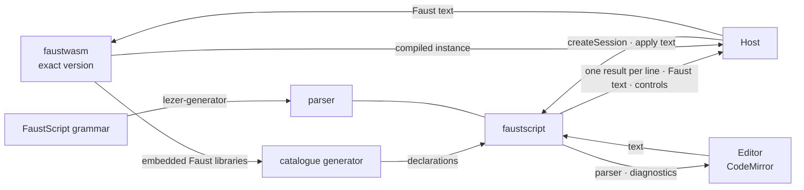
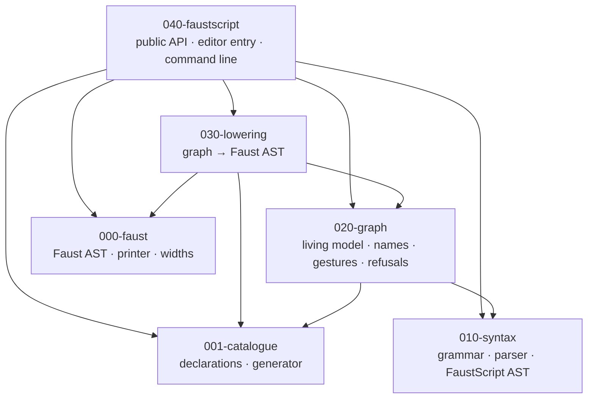
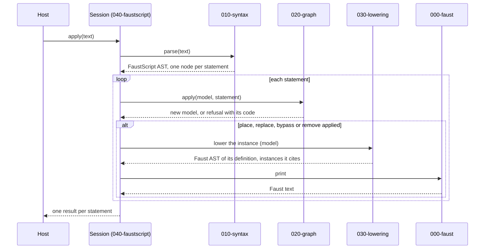

# FaustScript — architecture

FaustScript est une bibliothèque TypeScript, avec sa ligne de commande, qui tient le graphe d'un morceau joué et en écrit du Faust. Elle lit le texte FaustScript en un arbre typé avec un analyseur généré à partir de la grammaire, applique chaque ligne comme un geste sur un graphe vivant dont les noms se résolvent sur cet arbre, abaisse le graphe en un arbre de Faust, et imprime cet arbre comme le texte Faust que l'hôte compile. Six paquets portent ces étapes ; l'un d'eux, `faustscript`, est publié. Ce document décrit la construction cible : le code l'atteint paquet par paquet (faustx-zj5.30 à faustx-zj5.36). Le rôle et la frontière du paquet public sont dans `packages/040-faustscript/docs/CADRE.md`, les formes qui la traversent dans `packages/040-faustscript/docs/INTERFACE.md`.

## 1. Contexte

L'hôte crée une session pour chaque morceau, lui envoie du texte FaustScript, et compile le Faust qu'elle retourne avec faustwasm, à la version exacte que le paquet déclare comme dépendance de pair. Un éditeur lit l'analyseur de la grammaire depuis une seconde entrée du même paquet, et les diagnostics d'un texte depuis la session qui joue. Deux outils préparent des entrées avant toute exécution : le générateur construit le catalogue à partir des bibliothèques Faust que cette version de faustwasm embarque, et `lezer-generator` construit l'analyseur à partir de la grammaire.

La commande `faustscript` est un hôte à part entière : elle applique un fichier `.fsc` à une nouvelle session et écrit le programme entier.

## 2. Stratégie

1. **La grammaire porte les signes de FaustScript.** L'analyseur est généré à partir de la grammaire, et le code lit des noms de nœuds, jamais le texte d'un signe. Raison : renommer un signe ne change que la grammaire, et l'analyseur qui tourne est la grammaire publiée, celle avec laquelle un éditeur colore la syntaxe.
2. **Chaque langage a un seul arbre, lu une fois.** Un texte FaustScript devient un AST FaustScript qui garde chaque position ; un corps devient un nœud typé, un appel au catalogue avec ses arguments ordonnés ou une expression Faust sous forme d'arbre. La sortie Faust est un AST Faust. Chaque étape lit l'arbre que l'étape précédente a construit. Raison : un arbre porte ce que signifie une écriture, là où une étape qui découpe ou relit du texte doit le deviner (Babel sépare l'analyse, les arbres et l'impression pour la même raison).
3. **Le graphe résout les noms sur l'arbre.** Une ligne est un geste sur un graphe vivant qui garde instances et câbles entre les appels ; ce qu'un nom désigne (`lpf1(fc=400)` est un appel ou un réglage selon ce qui est placé) et ce qu'un corps cite se résolvent sur l'AST FaustScript, face au graphe et au catalogue. Raison : une ligne tapée pendant que le son joue décrit un changement, pas un programme ; seul le graphe sait ce qui est placé, comme le font les proxys nommés de SuperCollider (`Ndef`).
4. **L'abaissement construit un AST Faust et un imprimeur l'écrit.** Le graphe s'abaisse en définitions Faust, une par instance, et en un programme écrit directement ou en étages ; l'imprimeur place les parenthèses selon la précédence. Raison : les formes de Faust (`route`, `si.bus`, un appel) sont des nœuds d'arbre que l'imprimeur écrit d'une seule façon, et l'hôte compile la définition d'une seule instance après un geste au lieu du programme.
5. **Un seul paquet est publié.** `faustscript` assemble les cinq paquets internes, qui sont privés et importés par leur nom dans l'espace de travail ; son API est choisie par FaustScript. Raison : FaustScript est un tout cohérent, comme TypeScript publie un seul paquet par-dessus de nombreux modules internes et livre son service de langage comme seconde entrée.
6. **Un seul Faust.** Le catalogue est généré à partir des bibliothèques embarquées dans faustwasm à une version exacte, les tests compilent avec cette version, et le paquet public la déclare. Raison : un module, une largeur ou une erreur de compilation est celui que donne Faust, et l'hôte joue le Faust que les tests ont vérifié.

## 3. Les paquets

Une flèche est un import. Un paquet n'importe que des paquets de numéro inférieur ; une règle de dépendance par paquet et un test interface contre types tiennent chaque frontière.

- **000-faust** contient l'AST Faust (série, parallèle, répartition, fusion, récursion, route, appel, identifiant, nombre, définition), son imprimeur, et les largeurs d'une expression calculées sur l'arbre. Son vocabulaire est celui de Faust seul, et c'est le paquet le plus bas. Ses documents : `packages/000-faust/docs/`.
- **001-catalogue** contient les déclarations des modules des bibliothèques de Faust et leur générateur, et les expose comme une seule valeur typée figée : modules, ports, valeurs de départ, bornes, les paramètres que Faust exige constants, entrées et sorties, et la marque d'un module que faustwasm ne fournit pas. Il est lu une fois par processus. Ses documents : `packages/001-catalogue/docs/`.
- **010-syntax** contient la grammaire, l'analyseur généré à partir d'elle, et l'AST FaustScript en lequel l'arbre de l'analyseur est lu, avec la position de chaque nœud. Une ligne qui ne se lit pas est refusée ici. Il importe `@lezer/lr` à l'exécution, et aucun autre paquet des six. Ses documents : `packages/010-syntax/docs/`.
- **020-graph** contient le modèle vivant d'un morceau : instances, câbles, réglages, marques et le compteur des signaux calculés. Il applique l'AST d'une ligne comme un geste, résout ses noms face au modèle et au catalogue, et retourne soit un nouveau modèle, soit un refus codé qui laisse le modèle inchangé. Il importe 010-syntax et 001-catalogue. Ses documents : `packages/020-graph/docs/`.
- **030-lowering** traduit un modèle figé en un AST Faust : une définition par instance, le programme écrit directement ou en étages, le routage entre les étages, l'adaptation des largeurs, un contrôle pour chaque port réglé. Il importe 020-graph, 001-catalogue et 000-faust. Ses documents : `packages/030-lowering/docs/`.
- **040-faustscript** est le paquet publié `faustscript` : `createSession` et la `Session`, l'entrée `faustscript/editor` avec l'analyseur, et la ligne de commande. Il appelle les cinq autres dans l'ordre et retourne leurs résultats sous les formes publiques ; les règles de traduction leur appartiennent. Ses documents : `packages/040-faustscript/docs/`.

## 4. Les données

Chaque frontière porte une seule représentation :

| frontière | représentation | créée par | lue par | durée de vie |
| --- | --- | --- | --- | --- |
| 010-syntax → 020-graph | AST FaustScript : un nœud par ligne, corps typés, positions | 010-syntax, à chaque `apply` | 020-graph ; 040-faustscript pour les numéros de ligne et les diagnostics | un `apply` |
| 001-catalogue → 020-graph, 030-lowering | catalogue : modules typés figés | 001-catalogue, une fois par processus | 020-graph, 030-lowering ; 040-faustscript pour `catalogue()` | le processus |
| 020-graph → 030-lowering | modèle résolu : instances, câbles, réglages et signaux calculés, figés | 020-graph, à chaque ligne appliquée | 030-lowering ; 040-faustscript pour `graph()` | jusqu'à la ligne appliquée suivante |
| 030-lowering → 000-faust | AST Faust : définitions et `process` | 030-lowering, à chaque geste qui recompile ou `write` | l'imprimeur et le calcul des largeurs de 000-faust | un appel |
| 000-faust → 040-faustscript | texte Faust imprimé | l'imprimeur de 000-faust | 040-faustscript, dans un résultat de ligne ou `write` | retourné à l'hôte |
| 040-faustscript → hôte | `Session`, résultats de ligne, programme, vues, contrôles, diagnostics | 040-faustscript | l'hôte, l'éditeur | comme le dit `INTERFACE.md` |

Une **session** est le morceau joué : elle possède un modèle résolu et son compteur de signaux calculés, et lit le catalogue que toutes les sessions partagent. Deux sessions ne partagent aucun autre état. Le graphe garde les instances et les câbles dans l'ordre où ils ont été placés et posés, et chaque étape suivante itère dans cet ordre.

## 5. Le déroulement

`apply` lit le texte entier une fois, puis traite ses instructions dans l'ordre ; une ligne vide ou un commentaire ne donne aucune instruction. Chaque ligne est résolue et appliquée en entier ou refusée en entier, et son résultat décrit la ligne au moment où elle a été appliquée.

`write` abaisse le modèle entier et l'imprime. Le programme s'écrit directement quand chaque instance alimente au plus une destination, et en étages sinon : Faust construit un circuit pour chaque occurrence d'un nom, donc un signal partagé s'écrit une fois et ses destinations le lisent ; un modèle vide donne un programme silencieux. `controls` lit les ports réglés et bornés du programme abaissé. `diagnose` lit un texte face au graphe de la session comme `apply` le ferait, n'en garde aucun effet, et fait de chaque refus un diagnostic à la position que porte son nœud d'AST FaustScript.

## 6. L'exécution

Les paquets sont des sources TypeScript à syntaxe effaçable seulement, que la chaîne d'outils du consommateur lit telles quelles, sans étape de construction entre les deux. Ils tournent dans le processus et le fil d'exécution de l'hôte, sous Node 22 ou plus récent ou dans un navigateur. Chaque appel est synchrone et ne fait aucune entrée ni sortie ; seule la ligne de commande lit et écrit des fichiers. Le catalogue est lu une fois par processus, au premier usage. faustwasm tourne dans l'hôte ; les tests compilent chaque forme imprimée et chaque programme gravé avec la version déclarée.

## 7. Les concepts transversaux

- **L'identité.** Une instance s'identifie par le nom que l'auteur a écrit ; un signal calculé par un nom que la session lui donne à partir de son propre compteur. Dans le Faust écrit, une instance dont le corps porte un contrôle est enveloppée dans un groupe qui porte son nom, si bien que son chemin de contrôle commence par le nom de l'instance.
- **Les erreurs.** Une faute dans une ligne est un refus avec un code pris dans une liste fermée, une phrase qui nomme la cause, ses paramètres et la position que lui donne l'AST FaustScript, les champs de la faute de BPScript ; l'étape qui la détecte refuse (010-syntax pour une ligne qui ne se lit pas, 020-graph pour le reste), et la ligne ne change rien. Un éditeur reçoit les mêmes refus comme diagnostics du Language Server Protocol. Une erreur du compilateur Faust reste le message du compilateur, que l'hôte reçoit. Le son continue : une ligne refusée laisse ce qui joue, comme Strudel montre une erreur et continue de jouer.
- **Le déterminisme.** Le modèle, le catalogue et chaque itération suivent l'ordre d'insertion, et chaque valeur dérive du texte et du catalogue : le même texte dans le même ordre de gestes écrit le même Faust, au caractère près.
- **Les signes hors du code.** Les signes de FaustScript vivent dans la grammaire, les formes de Faust dans l'imprimeur de 000-faust, et les règles de traduction dans 030-lowering, décrites dans `LANGUAGE.md`. Un garde lit le code de chaque paquet et échoue sur un signe du langage écrit dedans.

## 8. La qualité

Le coût qui compte est une ligne appliquée plus la compilation d'une instance par l'hôte, dans un budget mesuré avec un plafond qui ne fait que baisser. La compilation dans l'hôte pèse plus que le travail propre de FaustScript par ligne, et croît avec la taille du Faust compilé : c'est pourquoi un geste retourne la définition d'une seule instance. Les chiffres, temps de compilation d'une instance contre un programme entier et calcul qu'ajoute un programme écrit en étages, sont la sortie du banc (faustx-zj5.25), lancé avec le faustwasm déclaré ; ce document n'en cite aucun.

## 9. Les risques

- **Le code et la cible.** Le code est un seul paquet (`src/`, `lib/`, `bin/`) : un arbre Lezer lu une fois par appel et découpé en chaînes, une sortie remplie à partir des gabarits de `lib/translation.fsc` et du Faust écrit dans le code, un compteur de signaux calculés partagé par le processus. Les tickets faustx-zj5.30 à faustx-zj5.36 le déplacent paquet par paquet dans l'ordre des numéros, chacun gardant les sorties gravées identiques.
- **La forme des déclarations.** Le catalogue s'écrit aujourd'hui en FaustScript (`lib/faust.fsc`), que seul 010-syntax lit, alors que 001-catalogue est sous 010-syntax ; la forme que lit 001-catalogue, et la façon dont le corps d'un module atteint 030-lowering sous forme d'arbre, sont tranchées par son cadre (faustx-zj5.29).
- **L'arbre d'un corps libre.** Un corps écrit comme une expression Faust est un arbre dans l'AST FaustScript, avec des positions ; qu'il reprenne les nœuds de 000-faust ou les siens est tranché par le cadre de 010-syntax (faustx-zj5.29).
- **Les gabarits jusqu'à 030-lowering.** `lib/translation.fsc` porte les mots réservés et les formes de Faust jusqu'à ce que 030-lowering le remplace (faustx-zj5.35) ; la règle selon laquelle les signes vivent dans la grammaire et dans `lib/` devient alors la règle selon laquelle ils vivent dans la grammaire.
- **L'atomicité et les codes de refus** (faustx-zj5.12, faustx-zj5.9) : une ligne refusée peut laisser une partie de ses câbles ou un signal calculé dans le graphe, et une issue porte une phrase sans code.
- **Les écarts avec la référence du langage** (faustx-zj5.13 à faustx-zj5.22, faustx-zj5.24, faustx-zj5.40) : chaque ticket nomme la règle de `LANGUAGE.md` et la ligne qui montre l'écart.
- **Ce que voit le garde** (faustx-zj5.11, faustx-zj5.36) : le garde des signes lit les chaînes littérales de `src/` pour quelques formes ; il passe dans 040-faustscript et lit chaque paquet.
- **Le coût d'une ligne** (faustx-zj5.25) : aucun banc ne le mesure encore, donc le budget n'a pas de plafond.
